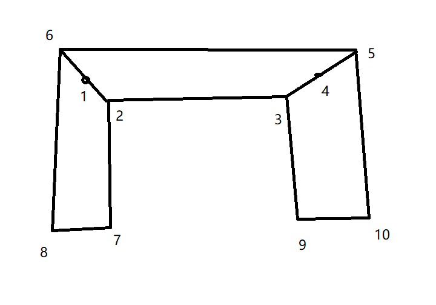

# U型窗公式图
## 参数
#### centerWidth 中间宽度
#### leftWidth 左边宽度
#### rightWidth 右边宽度
#### leftRadian 左边弧度
#### rightRadian 右边弧度
#### centerThickness 中间厚度
#### leftThickness 左厚度
#### rightThickness 右厚度
### 变异
#### leftLeftRadian 左边左弧度
#### Math.atan(Math.sin({{leftRadian}})/({{centerThickness}}/{{leftThickness}}+Math.cos({{leftRadian}})))
#### leftRightRadian 左边右弧度
#### Math.atan(Math.sin({{leftRadian}})/(({{leftThickness}}/{{centerThickness}})+Math.cos({{leftRadian}})))
#### rightRightRadian 右边右弧度
#### Math.atan(Math.sin({{rightRadian}})/(({{centerThickness}}/{{rightThickness}})+Math.cos({{rightRadian}})))
#### rightLeftRadian 右边左弧度
#### Math.atan(Math.sin({{rightRadian}})/({{rightThickness}}/{{centerThickness}}+Math.cos({{rightRadian}})))

## 1
#### x:0
#### y:0
## 2
#### x:{{centerThickness}}/2/Math.tan({{leftRightRadian}})
#### y:-{{centerThickness}}/2
## 3
#### x:{{centerThickness}}/2/Math.tan({{leftLeftRadian}})+{{centerWidth}}
#### y:-{{centerThickness}}/2
### 解析
#### x:2.x+{{centerWidth}}
#### y:2.y
## 4
#### x:?
#### y:?
## 5
#### x:{{centerThickness}}/2/Math.tan({{leftLeftRadian}})+{{centerWidth}}+({{centerThickness}}/Math.tan({{rightLeftRadian}}))
#### y:{{centerThickness}}/2
### 解析
#### x:3.x+({{centerThickness}}/Math.tan({{rightLeftRadian}}))
## 6
#### x:-{{centerThickness}}/2/Math.tan({{leftRightRadian}})
#### y:{{centerThickness}}/2
## 7
#### x:{{centerThickness}}/2/Math.tan({{leftRightRadian}})+(Math.cos({{leftRadian}})\*{{leftWidth}})
#### y:-{{centerThickness}}/2-(Math.sin({{leftRadian}})\*{{leftWidth}})
### 解析
#### x:2.x+(Math.cos({{leftRadian}})\*{{leftWidth}})
#### y:2.y-(Math.sin({{leftRadian}})\*{{leftWidth}})
## 8
#### x:{{centerThickness}}/2/Math.tan({{leftRightRadian}})+(Math.cos({{leftRadian}})\*{{leftWidth}})-(Math.cos(-{{leftRadian}}+(Math.PI/2))\*{{leftThickness}})
#### y:-{{centerThickness}}/2-(Math.sin({{leftRadian}})\*{{leftWidth}})-(Math.sin(-{{leftRadian}}+(Math.PI/2))\*{{leftThickness}})
### 解析
#### x:7.x-(Math.cos(-{{leftRadian}}+(Math.PI/2))\*{{leftThickness}})
#### y:7.y-(Math.sin(-{{leftRadian}}+(Math.PI/2))\*{{leftThickness}})
## 9
#### x:{{centerThickness}}/2/Math.tan({{leftLeftRadian}})+{{centerWidth}}-(Math.cos(-{{rightRadian}})\*{{rightWidth}})
#### y:-{{centerThickness}}/2+(Math.sin(-{{rightRadian}})\*{{rightWidth}})
### 解析
#### x:3.x+-(Math.cos(-{{rightRadian}})\*{{rightWidth}})
#### y:3.y+(Math.sin(-{{rightRadian}})\*{{rightWidth}})
## 10
#### x:{{centerThickness}}/2/Math.tan({{leftLeftRadian}})+{{centerWidth}}-(Math.cos(-{{rightRadian}})\*{{rightWidth}})+(Math.cos(-{{rightRadian}}+(Math.PI/2))\*{{rightThickness}})
#### y:-{{centerThickness}}/2+(Math.sin(-{{rightRadian}})\*{{rightWidth}})-(Math.sin(-{{rightRadian}}+(Math.PI/2))\*{{rightThickness}})
### 解析
#### x:9.x+(Math.cos(-{{rightRadian}}+(Math.PI/2))\*{{rightThickness}})
#### y:9.y-(Math.sin(-{{rightRadian}}+(Math.PI/2))\*{{rightThickness}})
#### test